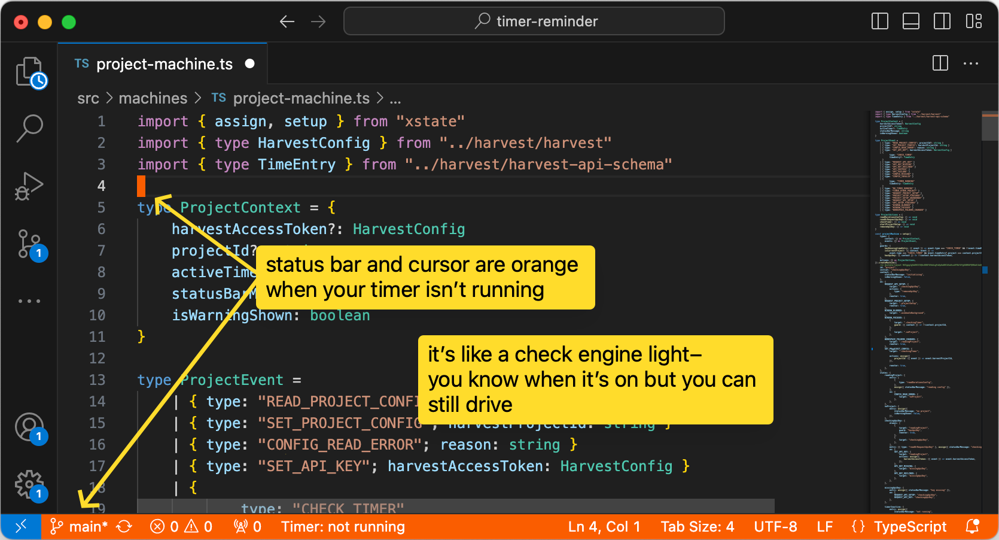

# vscode harvest timer reminder

turns the status bar and cursor orange when your harvest timer isn't running on the project you are working in.

supplies commands to make it easy to connect a vscode workspace to a project, and it stores that state on disk so you're able to add it to the project's repo.

the goal is to make it easier to jump between projects without misattributing timers, and to keep bookkeeping accurate when you jump right to work.



this is a companion app and only reads state to indicate if a timer isn't running. you'll still want to use it along side [harvest's apps](https://www.getharvest.com/apps).

## install

get the extension on the vscode extension marketplace:  
https://marketplace.visualstudio.com/items?itemName=schpet.timer-reminder

or install it via cli:

```bash
code --install-extension schpet.timer-reminder
```

you'll need a harvest ‘personal access token’, these can be created at  
https://id.getharvest.com/developers

## usage

to set up a project:

1. open the command palette with <kbd>⌘</kbd>+<kbd>shift</kbd>+<kbd>P</kbd> (on macOS) or <kbd>Ctrl</kbd>+<kbd>Shift</kbd>+<kbd>P</kbd> (on Windows/Linux)
2. type "timer reminder" and select "Timer Reminder: set harvest project" from the list
3. follow the prompts to select your harvest project

this will associate your current workspace with the selected harvest project

## assumptions

- you log into a single harvest account
- you work with a single vscode workspace
